# Emotion Diary

This is a simple diary. You can post your diary. When you create a diary, you can choose today's emotion as well. 

---

## Main Screen

  

    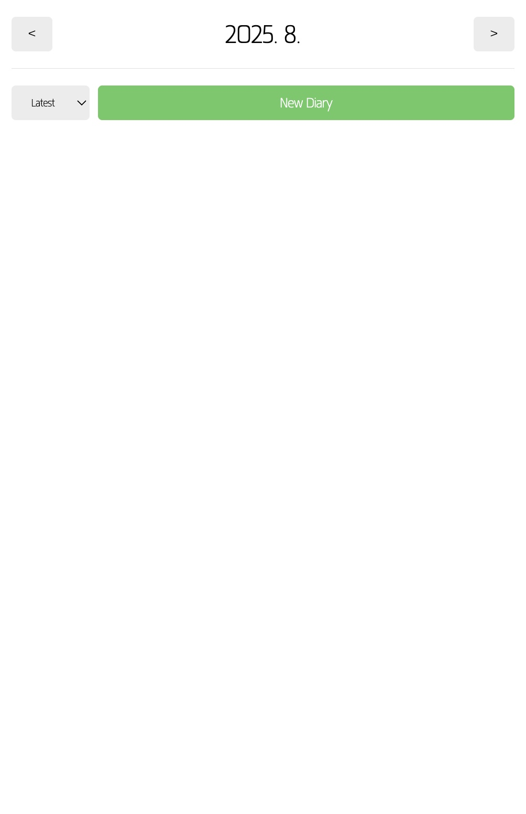
    
Main Screen

  

---

## Create Diary  

  

    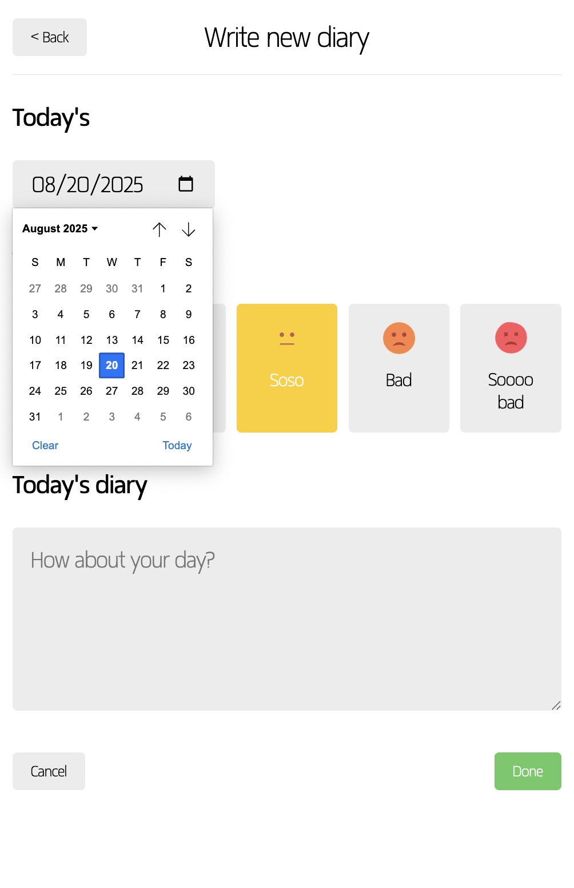
    
Select Date

  

  

    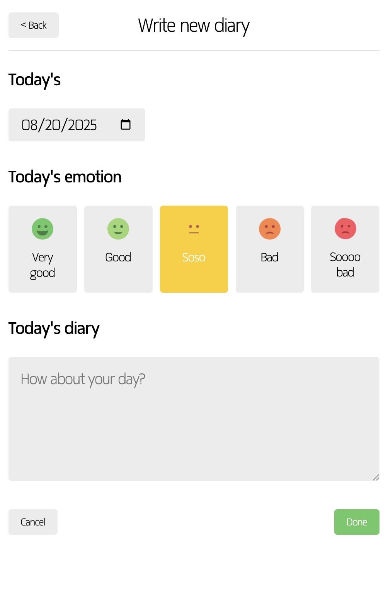
    
Set Date

  

  

    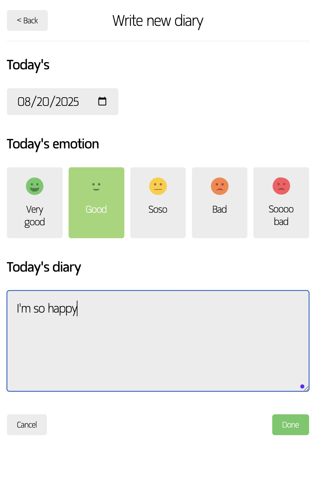
    
Select Emotion

  

  

---

## Post New diary

  

    
    
First Diary

  

---

## Click Diary

  

    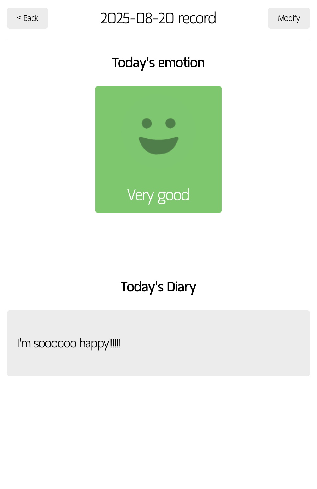
    
Specific Diary

  

---

## Edit Diary

  

    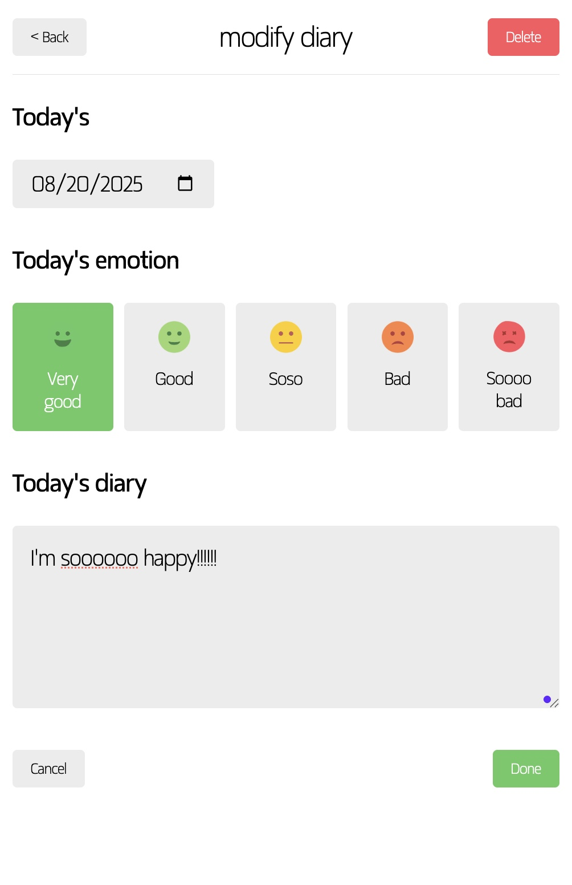
    
Edit Diary

  

  

    
    
Check Edit or not

  

  

    
    
Edited Diary

  

---

## Delete Diary

  

    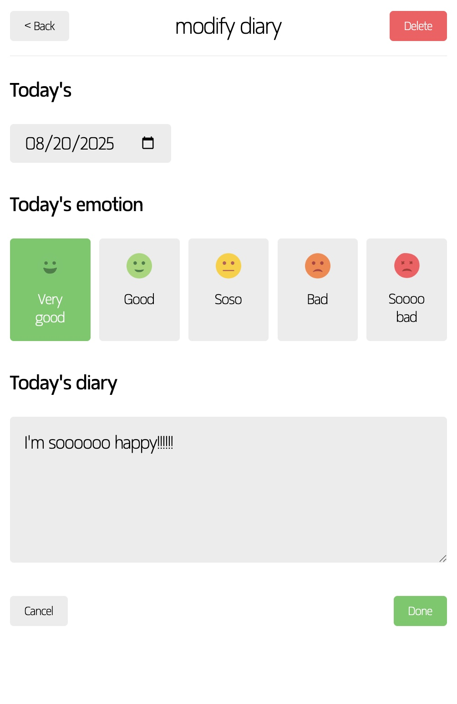
    
Delete Diary

  

  

    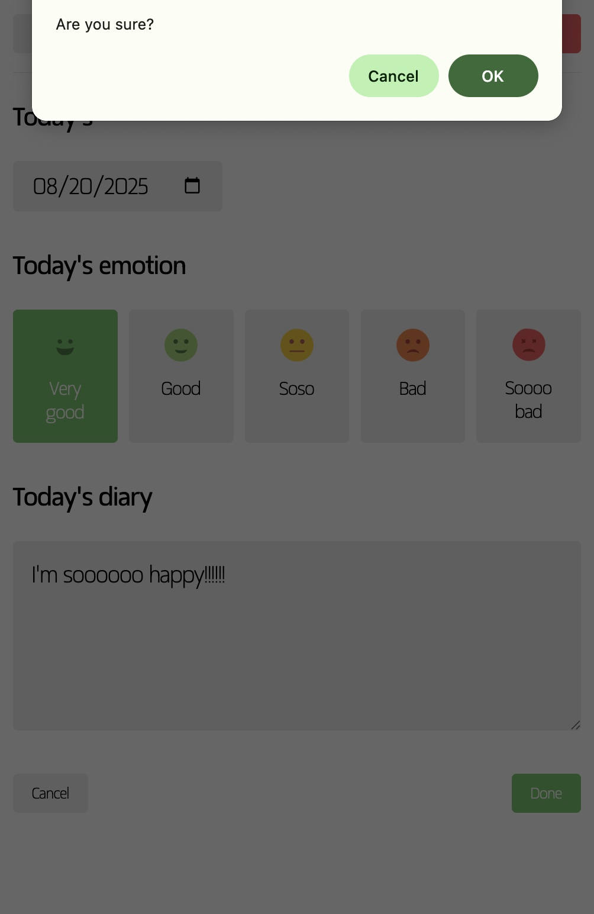
    
Check Delete or not

  

  

    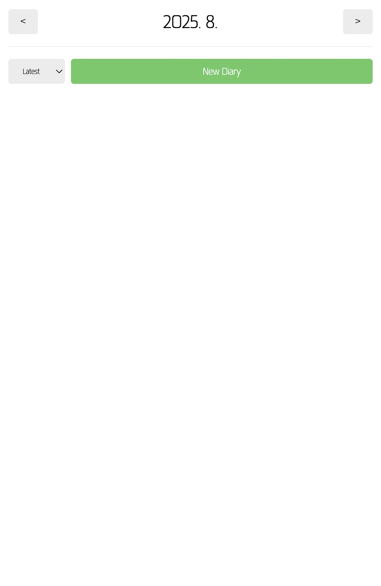
    
Deleted Diary

  

## Other Functions

  

    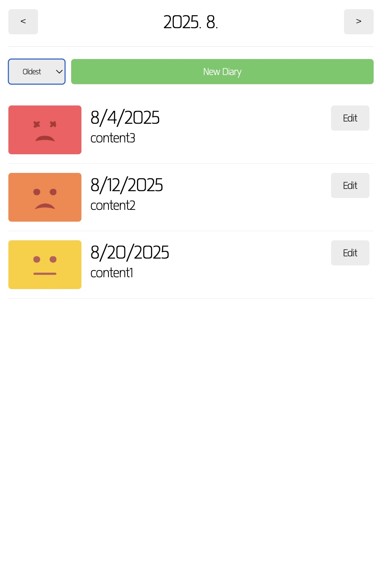
    
Diary Order : Oldest

  

  

    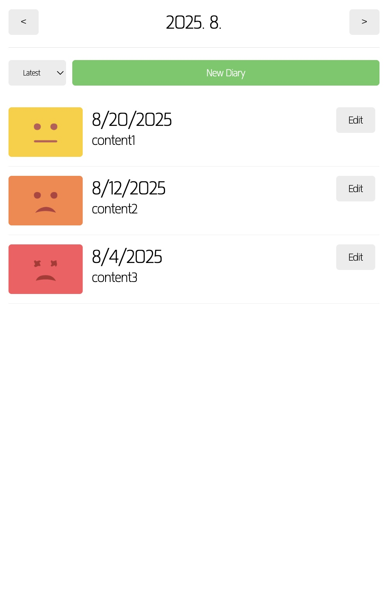
    
Diary Order : Latest

  

  

    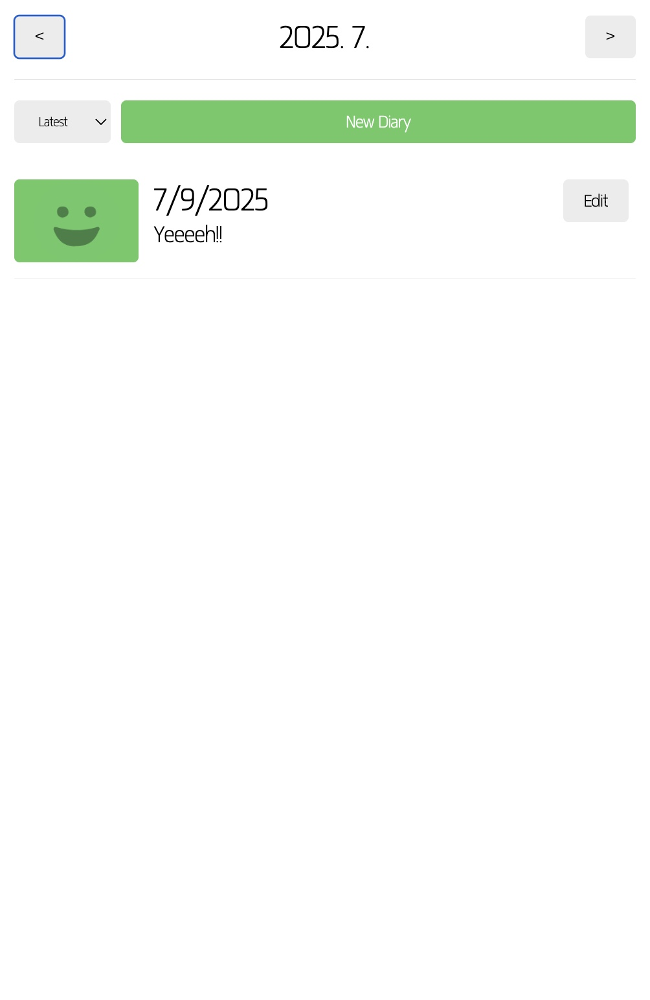
    
Move other month

  

